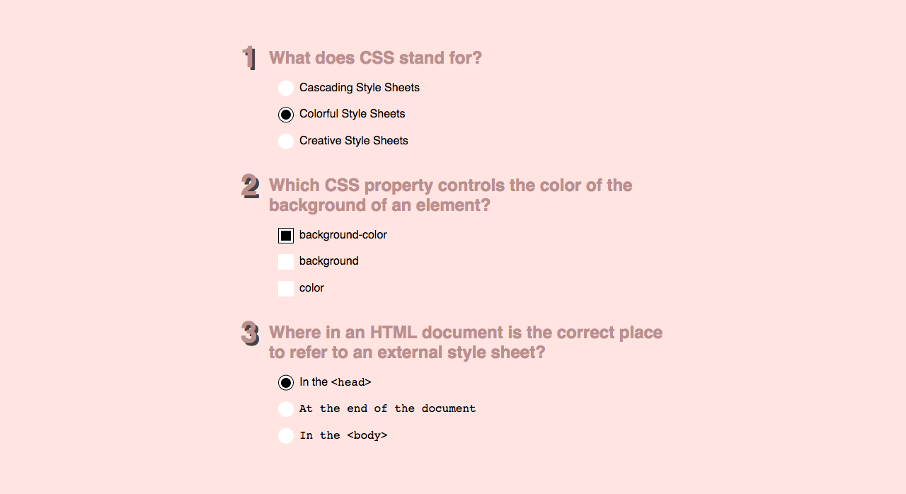

# Quiz form

Let's create a short quiz (add at least 3 questions).

There are 2 types of questions: multi-choice and single-choice.

Take a look at the example:

There is an animation going on when selecting the radio buttons and checkboxes, have a look in the movie.

Extra:

Add two buttons: one that submits the quiz with the selected answers, and one that cancels the form.

What semantic elements you could make use of?
